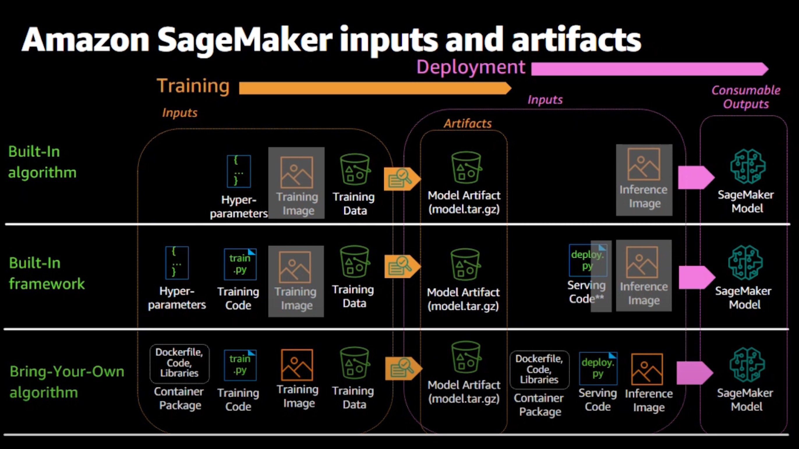
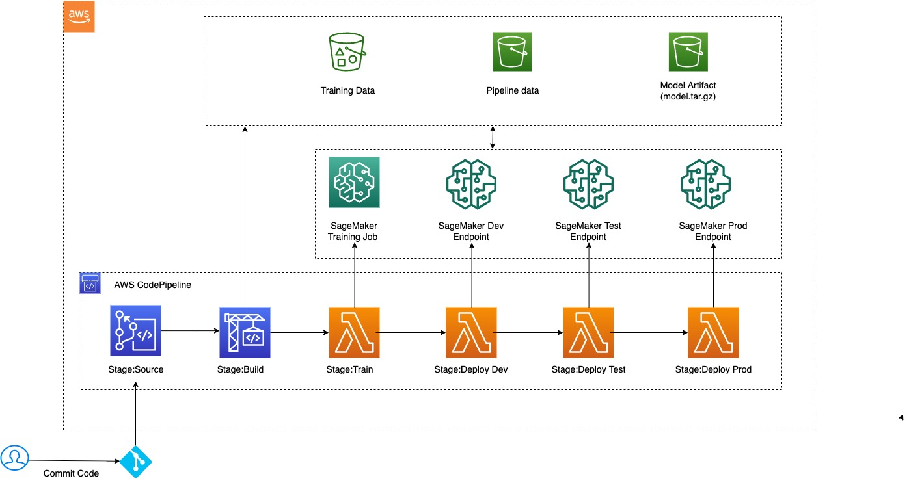

# MLOps: Using AWS Built-in TensorFlow Framework on SageMaker

AWS CodePipeline is a CI/CD orchestration tool for infrastructure on AWS. This example desmonstrates how to use CodePipeline to orchesrate a CI/CD pipeline for a TensorFlow model runing on Amazon SageMaker platform. This example uses AWS built-in TensorFlow framework to train and host model.

NASA turbo fan jet engine predictive maintainence data set is used in the current example. The CI/CD pipeline will build and host a time series classification model using TensorFlow framework. [Data set download link](https://ti.arc.nasa.gov/m/project/prognostic-repository/CMAPSSData.zip)

Built-in framework is one of methods using SageMaker services:

[Source: AWS re:Invent 2020: Implementing MLOps practices with Amazon SageMaker](https://www.youtube.com/watch?v=8ZpE-9LnaJk)

Built-in framework uses AWS pre-built TensorFlow images and your own training code to train and deploy models.

The following diagram depicts the architecure of the CI/CD pipeline. 

The pipeline includes the following six stages:

 1) Source: The source code stores in a CodeCommit repo. When there is code pushed, it will trigger the pipeline to update the model training and hosting.
 2) Build: Build source code and save as 'source.tar.gz' file into S3 bucket. In this step, it also downloads raw NASA data set and saves into S3 bucket.
 3) Train: Raw data will be prococessed and reshaped for TensorFlow model input. SageMaker training job is used to train the TensorFlow model.
 4) Deploy Dev: Model is deployed and tested in Dev environment. 
 5) Deploy Test: Model is deployed and tested in Test enrinoment.
 6) Deploy Prod: Model is deployed and tested in Prod enrinoment.

This is a basic pipeline that can be used to train and host your model. The following functionalities can be considered when building a customerized pipeline for a specific use case:
 * Cross-account deployments
 * Notification mechanisem 
 * Additional control and approval gates : manual or automatic 
 * Source control integration for lambda functions used in pipeline activities
 * Additional deployment options such as batch transform 
 * Creation of [API via API Gateway](https://docs.aws.amazon.com/apigateway/latest/developerguide/how-to-create-api.html) to be used for hosting predictions

-------
## Prerequisite

1) AWS Account & Administrator Access
2) AWS CLI installed. (https://docs.aws.amazon.com/cli/latest/userguide/install-cliv2.html)
3) Your AWS credentials. [You can create a new Access Key on this page.](https://docs.aws.amazon.com/sdk-for-javascript/v2/developer-guide/getting-your-credentials.html)
4) [Docker installed.](https://docs.docker.com/get-docker/) 
--------
## Instruction

### Deploy the pipeline

Run the following bash command at Terminal:

    ./deploy-cfn.sh

----

### Clean-Up

Please execute the following clean-up steps.  Note: These steps can be automated and/or done programmatically but doing manual clean to enforce what was created during the workshop. 

1. Login to the [AWS Console](https://https://console.aws.amazon.com/) and enter your credentials   

2. Select **Services** from the top menu, and choose **Amazon SageMaker**

   **Endpoints**
   * Go to **Inference / Endpoints** on the left hand menu, click the radio button next to each endpoint. 

   * Select **Actions** and then **Delete**, then confirm delete hitting the **Delete** button. 

3. Select **Services** from the top menu, and choose **S3**

    * Delete all S3 buckets created for this project
       
       

4. Select **Services** from the top menu, and choose **CloudFormation**

   * For the stack that were created in this workshop (MLOps-*), click the checkbox next to the stack.  Select **Actions** , then **Delete Stack**
---
`Copyright Amazon.com, Inc. or its affiliates. All Rights Reserved. SPDX-License-Identifier: MIT-0`